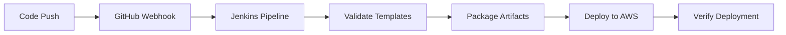

# practice-learning-faus-project
# Terraform Infrastructure for Jenkins CI/CD Pipeline

This Terraform configuration sets up a complete CI/CD infrastructure that connects your GitHub repository with Jenkins for automated deployments to AWS.

## 🏗️ Infrastructure Components

### AWS Resources
- **EC2 Instance**: Jenkins server with auto-installation
- **S3 Buckets**: Artifact storage and CloudFormation deployments
- **IAM Roles & Policies**: Secure permissions for Jenkins
- **VPC & Networking**: Isolated network environment
- **Security Groups**: Controlled access to Jenkins

### GitHub Integration
- **Webhooks**: Automatic pipeline triggers
- **Repository Secrets**: AWS credentials for GitHub Actions
- **Branch Protection**: Enforce code review requirements

## 🚀 Quick Start

### 1. Prerequisites
```bash
# Install Terraform
# Install AWS CLI and configure credentials
aws configure

# Install Git
```

### 2. Setup Configuration
```bash
# Clone your repository
git clone https://github.com/Faus7679/practice-learning-faus-project.git
cd practice-learning-faus-project/terraform

# Copy and edit configuration
cp terraform.tfvars.example terraform.tfvars
```

### 3. Configure Variables
Edit `terraform.tfvars`:
```hcl
# Required: GitHub Personal Access Token
github_token = "ghp_your_token_here"

# Optional: Your IP for security (recommended)
allowed_cidr_blocks = ["YOUR_IP/32"]

# Optional: AWS Key Pair for SSH access
key_pair_name = "your-key-pair-name"
```

### 4. Deploy Infrastructure
```bash
# Initialize Terraform
terraform init

# Plan deployment
terraform plan

# Deploy infrastructure
terraform apply
```

## 📋 Required GitHub Token Permissions

Create a GitHub Personal Access Token with these scopes:
- `repo` (Full repository access)
- `admin:repo_hook` (Repository webhooks)
- `admin:org_hook` (Organization webhooks)
- `write:packages` (GitHub Packages)

## 🔧 Post-Deployment Setup

### 1. Access Jenkins
After deployment, Terraform will output:
```
jenkins_server_url = "http://JENKINS_IP:8080"
```

### 2. Initial Jenkins Setup
1. SSH to Jenkins server: `ssh -i your-key.pem ec2-user@JENKINS_IP`
2. View setup info: `cat /home/ec2-user/jenkins-setup-complete.log`
3. Access Jenkins web interface
4. Login with default credentials:
   - Username: `admin`
   - Password: `admin123!`

### 3. Jenkins Configuration
The setup script automatically:
- ✅ Installs required plugins
- ✅ Configures AWS credentials
- ✅ Creates pipeline job
- ✅ Sets up GitHub integration

## 🔐 Security Configuration

### AWS Credentials
Jenkins uses IAM roles and users with minimal required permissions:
- CloudFormation operations
- S3 bucket access
- IAM role management (limited scope)

### Network Security
- Jenkins accessible on port 8080
- SSH access on port 22
- All outbound traffic allowed for updates and AWS API calls

### GitHub Integration
- Webhook validates requests
- Repository secrets store AWS credentials securely
- Branch protection enforces code review

## 📊 Pipeline Workflow



### Pipeline Stages
1. **Checkout**: Get code from GitHub
2. **Validate**: Check CloudFormation syntax
3. **Package**: Prepare deployment artifacts
4. **Deploy**: Deploy to AWS environment
5. **Verify**: Confirm deployment success

## 🎛️ Configuration Options

### Environment Variables
```bash
# Terraform variables you can customize
export TF_VAR_environment="dev"
export TF_VAR_jenkins_instance_type="t3.medium"
export TF_VAR_aws_region="us-east-1"
```

### Jenkins Pipeline Parameters
- Environment selection (dev/staging/prod)
- Skip validation tests
- Deploy infrastructure toggle

## 🔄 Managing Environments

### Multiple Environments
Deploy separate environments:
```bash
# Development environment
terraform workspace new dev
terraform apply -var="environment=dev"

# Staging environment  
terraform workspace new staging
terraform apply -var="environment=staging"
```

### Environment-Specific Configuration
Each environment gets:
- Separate S3 buckets
- Isolated CloudFormation stacks
- Environment-specific resource naming

## 🛠️ Maintenance

### Updating Jenkins
```bash
# SSH to Jenkins server
ssh -i your-key.pem ec2-user@JENKINS_IP

# Update Jenkins
sudo yum update jenkins
sudo systemctl restart jenkins
```

### Monitoring
- Jenkins logs: `sudo journalctl -u jenkins -f`
- AWS CloudWatch logs for deployment monitoring
- S3 bucket lifecycle policies for artifact cleanup

## 🧹 Cleanup

### Destroy Infrastructure
```bash
# Remove all resources
terraform destroy

# Confirm destruction
# Type "yes" when prompted
```

### Manual Cleanup (if needed)
1. Delete CloudFormation stacks created by pipeline
2. Empty S3 buckets before destruction
3. Remove GitHub webhook (automatic with Terraform)

## 🔍 Troubleshooting

### Common Issues

**Jenkins not accessible:**
```bash
# Check security group allows your IP
# Verify EC2 instance is running
aws ec2 describe-instances --instance-ids INSTANCE_ID
```

**GitHub webhook failing:**
```bash
# Check Jenkins URL in webhook configuration
# Verify Jenkins GitHub plugin is installed
```

**AWS deployment errors:**
```bash
# Check IAM permissions
# Verify AWS credentials in Jenkins
# Review CloudFormation stack events
```

### Useful Commands
```bash
# Get Jenkins initial password
terraform output jenkins_initial_setup_info

# View all outputs
terraform output

# Check state
terraform state list
```

## 📞 Support

For issues:
1. Check Terraform output messages
2. Review Jenkins logs on EC2 instance
3. Verify AWS permissions and quotas
4. Check GitHub webhook delivery logs

## 🔗 Related Files
- `../Jenkinsfile` - Pipeline definition
- `../resources/create-s3-bucket.yaml` - CloudFormation template
- `../iam-role-and-policies.json` - IAM configurations
