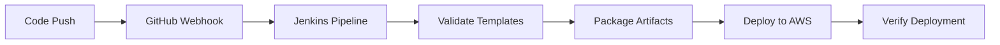
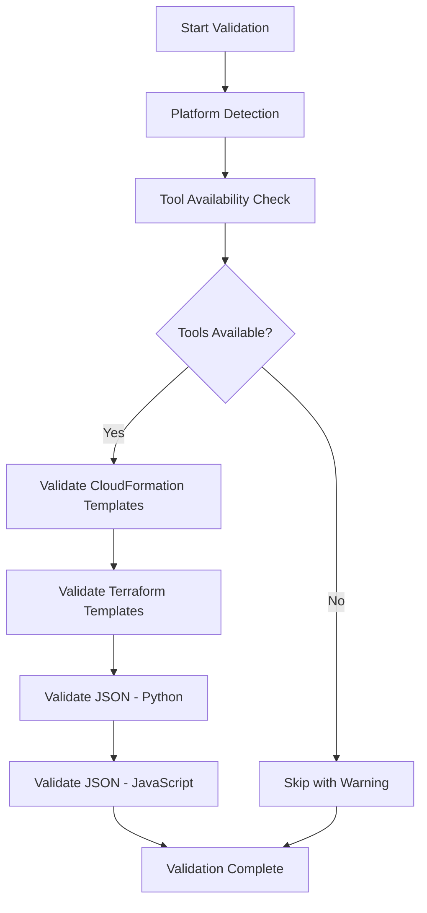

# practice-learning-faus-project
# Terraform Infrastructure for Jenkins CI/CD Pipeline

This Terraform configuration sets up a complete CI/CD infrastructure that connects your GitHub repository with Jenkins for automated deployments to AWS.

## 🆕 Recent Updates (November 2025)
- ✅ **Cross-Platform Compatibility**: Full Windows and Linux/Unix support using conditional logic
- ✅ **Enhanced Terraform Support**: Full Terraform template validation and packaging
- ✅ **Intelligent Tool Detection**: Pre-validation checks for Node.js, AWS CLI, Terraform, and Python
- ✅ **Robust Error Handling**: Comprehensive try-catch blocks with meaningful error messages
- ✅ **Smart S3 Bucket Management**: Environment-specific buckets instead of per-build buckets
- ✅ **Graceful Degradation**: Pipeline continues with warnings when tools are unavailable
- ✅ **File Existence Validation**: Checks for directories and files before operations
- ✅ **Enhanced Artifact Handling**: Platform-specific packaging (tar.gz on Unix, zip on Windows)
- ✅ **Visual Feedback System**: Clear success (✓) and error (✗) indicators throughout pipeline

## 🏗️ Infrastructure Components

### AWS Resources
- **EC2 Instance**: Jenkins server with cross-platform compatibility (Windows/Linux)
- **S3 Buckets**: Environment-specific artifact storage for Terraform templates and CloudFormation deployments
- **IAM Roles & Policies**: Secure permissions with enhanced validation
- **VPC & Networking**: Isolated network environment
- **Security Groups**: Controlled access to Jenkins with improved monitoring

### GitHub Integration
- **Webhooks**: Automatic pipeline triggers
- **Repository Secrets**: AWS credentials for GitHub Actions
- **Branch Protection**: Enforce code review requirements

## 🤖 Automated Deployment Template

### 🎯 **NEW: One-Click Deployment**
We've created a comprehensive deployment template that sets up the entire automated CI/CD infrastructure with a single command!

#### Features:
- ✅ **Complete Infrastructure**: Jenkins server, S3 buckets, IAM roles, networking
- ✅ **GitHub Webhook Integration**: Automatic build triggers on commits
- ✅ **Cross-Platform Pipeline**: Supports Windows and Linux Jenkins agents
- ✅ **Enhanced Monitoring**: CloudWatch logs and SNS notifications
- ✅ **Smart Tool Management**: Automatic installation and validation
- ✅ **Deployment Status Report**: Auto-generated status documentation

#### Quick Deploy Command:
```bash
# Navigate to terraform directory
cd terraform

# Configure your variables (see configuration section below)
cp terraform.tfvars.example terraform.tfvars
# Edit terraform.tfvars with your values

# Deploy complete infrastructure
terraform init
terraform apply -target="module.jenkins_infrastructure"

# Check deployment status
cat deployment-status.md
```

## 🚀 Quick Start

### 1. Prerequisites
```bash
# Install Terraform
# Install AWS CLI and configure credentials
aws configure

# Install Git
```

### 2. Setup Configuration
```bash
# Clone your repository
git clone https://github.com/Faus7679/practice-learning-faus-project.git
cd practice-learning-faus-project/terraform

# Copy and edit configuration
cp terraform.tfvars.example terraform.tfvars
```

### 3. Configure Variables
Edit `terraform.tfvars`:
```hcl
# Required: GitHub Personal Access Token (with repo and webhook permissions)
github_token = "ghp_your_github_token_here"

# GitHub repository information
github_owner = "Faus7679"
github_repo = "practice-learning-faus-project"

# AWS Configuration
aws_region = "us-east-1"
environment = "dev"  # or "staging", "prod"

# Security Configuration (IMPORTANT!)
allowed_cidr_blocks = ["YOUR_IP/32"]  # Replace with your IP

# Optional: AWS Key Pair for SSH access
key_pair_name = "your-aws-key-pair-name"

# Enable automated features
enable_jenkins_server = true
enable_github_webhooks = true
```

### ⚠️ **Important Security Notes:**
- **Replace `YOUR_IP/32`** with your actual IP address for security
- **Create GitHub Token** with `repo` and `admin:repo_hook` permissions
- **AWS Key Pair** recommended for SSH access to Jenkins server

### 4. Deploy Automated Infrastructure

#### Option A: Complete Automated Deployment (Recommended)
```bash
# Initialize Terraform
terraform init

# Deploy with automated Jenkins and webhooks
terraform apply

# Check deployment status
cat deployment-status.md

# Access Jenkins (wait 2-3 minutes for startup)
# URL will be shown in terraform output
```

#### Option B: Step-by-Step Deployment
```bash
# Plan deployment to see what will be created
terraform plan

# Deploy infrastructure only
terraform apply -target="aws_instance.jenkins_server"

# Deploy GitHub integration
terraform apply -target="github_repository_webhook.jenkins_build_trigger"

# Deploy complete infrastructure
terraform apply
```

### ⏰ **Post-Deployment (2-3 minutes)**
After deployment completes:
1. **Wait** for Jenkins to fully initialize (2-3 minutes)
2. **Access Jenkins** at the URL shown in terraform output
3. **Login** with `admin` / `admin123!`
4. **Check** the auto-created pipeline job
5. **Test** by pushing a commit to trigger automatic build

## 📋 Required GitHub Token Permissions

Create a GitHub Personal Access Token with these scopes:
- `repo` (Full repository access)
- `admin:repo_hook` (Repository webhooks)
- `admin:org_hook` (Organization webhooks)
- `write:packages` (GitHub Packages)

## 🔧 Post-Deployment Setup

### 1. Access Jenkins
After deployment, Terraform will output:
```
jenkins_server_url = "http://JENKINS_IP:8080"
```

### 2. Initial Jenkins Setup
1. SSH to Jenkins server: `ssh -i your-key.pem ec2-user@JENKINS_IP`
2. View setup info: `cat /home/ec2-user/jenkins-setup-complete.log`
3. Access Jenkins web interface
4. Login with default credentials:
   - Username: `admin`
   - Password: `admin123!`

### 3. Automated Jenkins Configuration
The enhanced setup script automatically:
- ✅ **Installs Enhanced Plugins**: 20+ plugins for comprehensive CI/CD
- ✅ **Configures GitHub Webhooks**: Automatic build triggers on commits
- ✅ **Creates Pipeline Jobs**: Auto-generated job for your repository
- ✅ **Sets Up Cross-Platform Tools**: Node.js, Terraform, Python, AWS CLI
- ✅ **Implements Smart Validation**: Tool detection with graceful degradation  
- ✅ **Configures AWS Integration**: Credentials, S3 buckets, CloudWatch
- ✅ **Enables Build Notifications**: SNS topics and Lambda processors
- ✅ **Sets Up Monitoring**: CloudWatch logs and build status tracking

## 🔄 Automated Build Process

### How It Works
1. **Commit to Repository** → GitHub sends webhook to Jenkins
2. **Jenkins Receives Webhook** → Automatically starts pipeline
3. **Cross-Platform Detection** → Pipeline adapts to Jenkins agent OS
4. **Smart Tool Validation** → Checks and reports tool availability
5. **Template Validation** → Validates Terraform and CloudFormation
6. **Packaging & Deployment** → Platform-specific artifact handling
7. **Notification & Monitoring** → SNS alerts and CloudWatch logging

### Supported Triggers
- ✅ **Push to main/master**: Full deployment pipeline
- ✅ **Push to feature branches**: Validation and testing
- ✅ **Pull requests**: Automated validation checks
- ✅ **Manual builds**: Available via Jenkins dashboard

## 🔐 Security Configuration

### AWS Credentials
Jenkins uses IAM roles and users with minimal required permissions:
- CloudFormation operations
- S3 bucket access
- IAM role management (limited scope)

### Network Security
- Jenkins accessible on port 8080
- SSH access on port 22
- All outbound traffic allowed for updates and AWS API calls

### GitHub Integration
- Webhook validates requests
- Repository secrets store AWS credentials securely
- Branch protection enforces code review

## 📊 Pipeline Workflow



### Pipeline Stages
1. **Checkout**: Cross-platform git operations with enhanced error handling
2. **Environment Setup**: Intelligent environment validation and S3 bucket configuration
3. **Validate**: Smart tool detection and comprehensive template validation
4. **Package**: Platform-specific packaging (tar.gz/zip) with existence validation
5. **Deploy**: Robust AWS deployment with comprehensive error handling
6. **Verify**: Enhanced post-deployment verification
7. **Cleanup**: Cross-platform temporary file cleanup

## 🖥️ Cross-Platform Compatibility

### Supported Platforms
The Jenkins pipeline now works seamlessly on both:
- **Windows**: PowerShell and batch commands
- **Linux/Unix**: Shell commands and standard Unix tools

### Platform Detection
The pipeline automatically detects the platform using `isUnix()` and executes appropriate commands:

```groovy
if (isUnix()) {
    sh 'date +%Y%m%d-%H%M%S'           // Unix/Linux
} else {
    powershell 'Get-Date -Format "yyyyMMdd-HHmmss"'  // Windows
}
```

### Tool Management
- **Intelligent Detection**: Checks for tool availability before use
- **Graceful Fallback**: Continues with warnings if tools are missing
- **Platform-Specific Commands**: Uses appropriate package managers and file operations

## ✅ Enhanced Validation Features

### Multi-Language Template Validation
The pipeline now supports comprehensive validation:

#### Terraform Templates
- **Format Validation**: `terraform fmt -check` ensures consistent formatting
- **Configuration Validation**: `terraform validate` checks syntax and configuration
- **Initialization**: Backend-free initialization for validation

#### CloudFormation Templates
- **AWS CLI Validation**: Native CloudFormation template validation
- **Syntax Checking**: YAML/JSON structure validation

#### JSON File Validation
- **Dual Validation Approach**:
  - **Python**: `python -m json.tool` for syntax validation (cross-platform)
  - **JavaScript/Node.js**: Enhanced validation with detailed error reporting
- **Smart Tool Detection**: Checks tool availability before validation
- **Graceful Degradation**: Skips validation if tools unavailable (with warnings)
- **Visual Feedback**: Success (✓) and error (✗) indicators for clear status
- **File Existence Checks**: Validates files exist before processing

### Enhanced Validation Process Flow


## 🎛️ Configuration Options

### Environment Variables
```bash
# Terraform variables you can customize
export TF_VAR_environment="dev"
export TF_VAR_jenkins_instance_type="t3.medium"
export TF_VAR_aws_region="us-east-1"
```

### Jenkins Pipeline Parameters
- Environment selection (dev/staging/prod)
- Skip validation tests
- Deploy Terraform templates and CloudFormation infrastructure toggle

## � Monitoring Automated Builds

### Build Status Monitoring
- **Jenkins Dashboard**: Real-time build status and logs
- **GitHub Integration**: Commit status checks and PR validation
- **CloudWatch Logs**: Centralized logging for all builds
- **SNS Notifications**: Alerts for build failures and successes

### Quick Monitoring Commands
```bash
# Check Jenkins status
curl http://YOUR_JENKINS_IP:8080/api/json

# View recent builds
curl -u admin:admin123! http://YOUR_JENKINS_IP:8080/job/REPO_NAME-auto-pipeline/api/json

# Monitor build logs via SSH
ssh -i ~/.ssh/YOUR_KEY.pem ec2-user@YOUR_JENKINS_IP 'sudo journalctl -u jenkins -f'

# Check CloudWatch logs
aws logs describe-log-groups --log-group-name-prefix "/aws/jenkins"
```

### Automated Build Features
- **Cross-Platform Compatibility**: Automatically detects Windows vs Linux
- **Smart Error Recovery**: Continues with warnings instead of failing
- **Artifact Management**: Environment-specific S3 storage
- **Tool Validation**: Pre-flight checks for all required tools
- **Visual Feedback**: Clear success/failure indicators

## 🔧 Automated Deployment Management

### Environment-Specific Deployments
Each automated deployment includes:
- **Smart S3 Buckets**: `faus-deployment-artifacts-{environment}`
- **Environment Validation**: Automatic parameter validation
- **Resource Naming**: Consistent, predictable naming
- **Rollback Capability**: CloudFormation stack management

## �🔄 Managing Environments

### Multiple Environments
Deploy separate environments:
```bash
# Development environment
terraform workspace new dev
terraform apply -var="environment=dev"

# Staging environment  
terraform workspace new staging
terraform apply -var="environment=staging"
```

### Environment-Specific Configuration
Each environment gets:
- **Smart S3 Buckets**: `faus-deployment-artifacts-{environment}` (no per-build buckets)
- **Isolated CloudFormation Stacks**: Environment-specific stack names
- **Intelligent Resource Naming**: Consistent, predictable naming conventions
- **Enhanced Error Handling**: Graceful failure handling with meaningful messages

### Enhanced Pipeline Features
- **Cross-Platform Support**: Automatic Windows/Linux detection
- **Tool Validation**: Pre-flight checks for all required tools
- **Graceful Degradation**: Continues with warnings when tools unavailable
- **File Validation**: Checks file/directory existence before operations
- **Robust Error Handling**: Try-catch blocks throughout with clear error messages

## 🛠️ Maintenance

### Updating Jenkins
```bash
# SSH to Jenkins server
ssh -i your-key.pem ec2-user@JENKINS_IP

# Update Jenkins
sudo yum update jenkins
sudo systemctl restart jenkins
```

### Monitoring
- Jenkins logs: `sudo journalctl -u jenkins -f`
- AWS CloudWatch logs for deployment monitoring
- S3 bucket lifecycle policies for artifact cleanup

## 🧹 Cleanup

### Destroy Infrastructure
```bash
# Remove all resources
terraform destroy

# Confirm destruction
# Type "yes" when prompted
```

### Manual Cleanup (if needed)
1. Delete CloudFormation stacks created by pipeline
2. Empty S3 buckets before destruction
3. Remove GitHub webhook (automatic with Terraform)

## 🔍 Troubleshooting

### Common Issues

**Jenkins not accessible:**
```bash
# Check security group allows your IP
# Verify EC2 instance is running
aws ec2 describe-instances --instance-ids INSTANCE_ID
```

**GitHub webhook failing:**
```bash
# Check Jenkins URL in webhook configuration
# Verify Jenkins GitHub plugin is installed
```

**AWS deployment errors:**
```bash
# Check IAM permissions
# Verify AWS credentials in Jenkins
# Review CloudFormation stack events
```

**Template validation failures:**
```bash
# Check Terraform syntax: terraform validate
# Verify JSON files: node -e "JSON.parse(require('fs').readFileSync('file.json'))"
# Test CloudFormation: aws cloudformation validate-template --template-body file://template.yaml
```

**Cross-platform issues:**
```bash
# Windows - Check PowerShell execution policy
Get-ExecutionPolicy
Set-ExecutionPolicy RemoteSigned

# Linux/Unix - Check shell availability
which bash
echo $SHELL
```

**Tool availability issues:**
```bash
# Check tool versions
node --version
terraform version
aws --version
python --version

# Windows tool installation
choco install nodejs terraform awscli python

# Linux tool installation (Ubuntu/Debian)
sudo apt-get update
sudo apt-get install nodejs terraform awscli python3
```

**S3 bucket issues:**
```bash
# Check bucket permissions and existence
aws s3 ls s3://faus-deployment-artifacts-dev
aws s3api get-bucket-location --bucket faus-deployment-artifacts-dev
```

**Automated build not triggering:**
```bash
# Check webhook configuration
curl -u YOUR_GITHUB_TOKEN: https://api.github.com/repos/Faus7679/practice-learning-faus-project/hooks

# Test webhook manually
curl -X POST http://YOUR_JENKINS_IP:8080/github-webhook/

# Check Jenkins GitHub plugin
curl -u admin:admin123! http://YOUR_JENKINS_IP:8080/pluginManager/api/json?depth=1 | grep github
```

**Build failures with tool detection:**
```bash
# Check tool availability on Jenkins server
ssh -i ~/.ssh/YOUR_KEY.pem ec2-user@YOUR_JENKINS_IP '
  echo "Node.js: $(node --version 2>/dev/null || echo MISSING)"
  echo "Terraform: $(terraform version 2>/dev/null || echo MISSING)"
  echo "Python: $(python3 --version 2>/dev/null || echo MISSING)"
  echo "AWS CLI: $(aws --version 2>/dev/null || echo MISSING)"
'

# Re-run enhanced setup if tools missing
ssh -i ~/.ssh/YOUR_KEY.pem ec2-user@YOUR_JENKINS_IP 'sudo /opt/jenkins-enhanced-setup.sh'
```

**Pipeline permission issues:**
```bash
# Check AWS credentials in Jenkins
curl -u admin:admin123! "http://YOUR_JENKINS_IP:8080/credentials/store/system/domain/_/credential/aws-credentials/api/json"

# Test AWS access from Jenkins
ssh -i ~/.ssh/YOUR_KEY.pem ec2-user@YOUR_JENKINS_IP 'sudo -u jenkins aws s3 ls'
```

### Useful Commands
```bash
# Get Jenkins initial password
terraform output jenkins_initial_setup_info

# View all outputs
terraform output

# Check state
terraform state list
```

## 📞 Support

For issues:
1. Check Terraform output messages
2. Review Jenkins logs on EC2 instance
3. Verify AWS permissions and quotas
4. Check GitHub webhook delivery logs

## 🔗 Related Files

### Core Pipeline Files
- `../Jenkinsfile` - **Cross-platform Jenkins pipeline** with enhanced error handling and smart tool detection
- `../resources/create-s3-bucket.yaml` - CloudFormation template with existence validation
- `../iam-role-and-policies.json` - IAM configurations with enhanced error handling

### Terraform Infrastructure
- `terraform/main.tf` - Main Terraform configuration
- `terraform/deploy-template.tf` - **NEW: Automated deployment orchestration**
- `terraform/complete-deploy.tf` - **NEW: Complete infrastructure deployment**
- `terraform/github.tf` - GitHub webhook and integration configuration
- `terraform/variables.tf` - Configuration variables and validation

### Enhanced Setup Scripts
- `terraform/scripts/jenkins-setup.sh` - Basic Jenkins installation
- `terraform/scripts/jenkins-enhanced-setup.sh` - **NEW: Enhanced setup with automation**

### Templates and Documentation
- `terraform/templates/jenkins-job.xml.tpl` - **NEW: Automated Jenkins job template**
- `terraform/templates/lambda-handler.py.tpl` - **NEW: Build notification processor**
- `terraform/templates/deployment-status.md.tpl` - **NEW: Auto-generated status report**
- `deployment-status.md` - **Generated after deployment** - Complete status and access info

## � Key Benefits of Automated Deployment

### 🚀 **Zero-Touch Automation**
- **One Command Deployment**: Complete infrastructure with `terraform apply`
- **Auto-Configured Webhooks**: GitHub integration set up automatically  
- **Self-Configuring Pipeline**: Jenkins job created and configured
- **Instant Build Triggers**: Commits automatically start builds

### 🛡️ **Enterprise-Ready Reliability**  
- **Cross-Platform Support**: Works on Windows and Linux Jenkins agents
- **Graceful Error Handling**: Continues with warnings, doesn't fail completely
- **Smart Tool Detection**: Validates tools before use, reports missing ones
- **Comprehensive Monitoring**: CloudWatch logs, SNS notifications, status reports

### 💡 **Developer Experience**
- **Visual Feedback**: Clear ✓/✗ indicators throughout pipeline
- **Detailed Status Reports**: Auto-generated deployment documentation
- **Quick Troubleshooting**: Built-in diagnostic commands and validation
- **Flexible Configuration**: Environment-specific deployments (dev/staging/prod)

### 💰 **Cost Optimization**
- **Smart S3 Usage**: Environment-specific buckets, no per-build waste
- **Efficient Resource Management**: Conditional resource creation
- **Automated Cleanup**: Temporary file management and artifact lifecycle

## �🎯 Pipeline Compatibility Matrix

| Feature | Windows | Linux/Unix | Status |
|---------|---------|------------|---------|
| Git Operations | ✅ | ✅ | Full Support |
| Tool Detection | ✅ | ✅ | Smart Detection |
| Template Validation | ✅ | ✅ | Cross-Platform |
| S3 Operations | ✅ | ✅ | Enhanced |
| Error Handling | ✅ | ✅ | Comprehensive |
| File Packaging | ZIP | TAR.GZ | Platform-Specific |

## 🚀 Getting Started on Windows

### Prerequisites for Windows
```powershell
# Install Chocolatey (Windows package manager)
Set-ExecutionPolicy Bypass -Scope Process -Force
iex ((New-Object System.Net.WebClient).DownloadString('https://chocolatey.org/install.ps1'))

# Install required tools
choco install git
choco install awscli
choco install terraform
choco install nodejs
choco install python
```

### Jenkins Agent Requirements
- **Windows**: PowerShell 5.1+ and Command Prompt access
- **Linux/Unix**: Bash shell and standard Unix tools
- **Both**: Git, AWS CLI (optional), Terraform (optional), Node.js (optional), Python (optional)

> **Note**: The pipeline will detect missing tools and continue with warnings, making it resilient to incomplete environments.